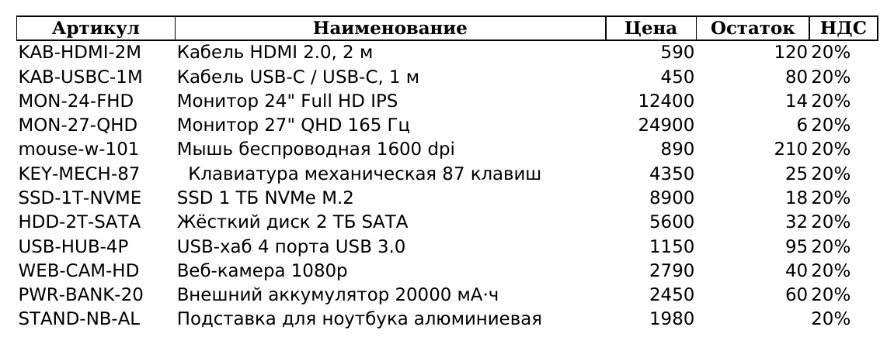
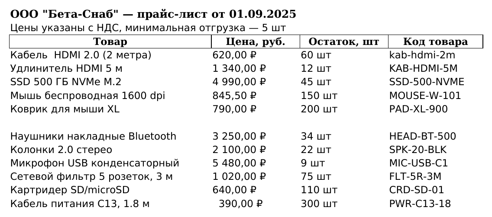
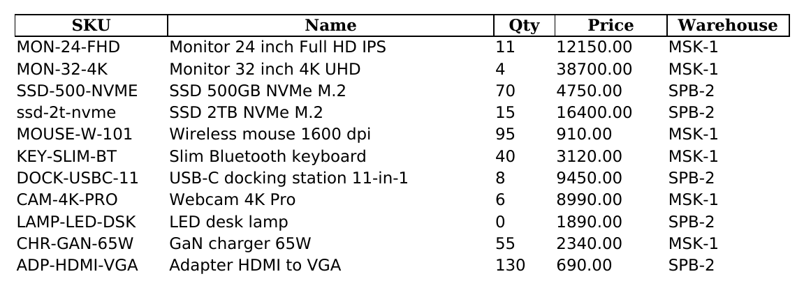
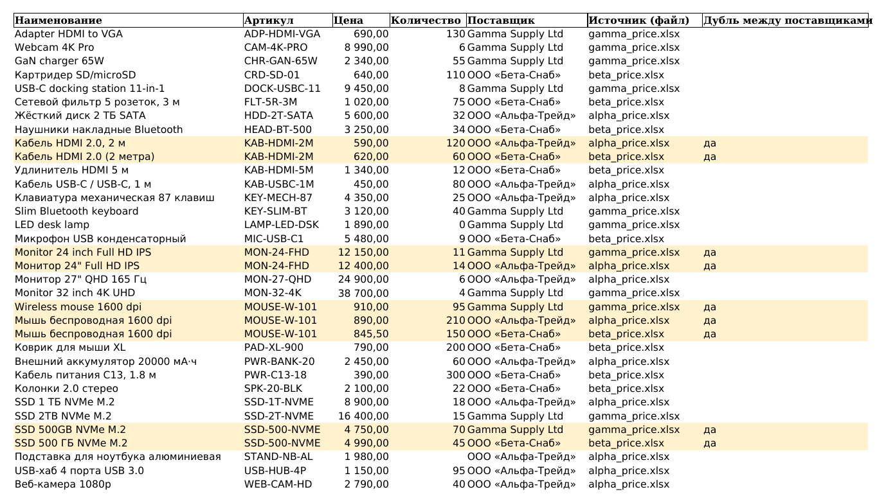

# Объединение прайс-листов разных поставщиков в один сводный файл

Консольный скрипт на Python, который берёт несколько Excel-прайсов **с разной
структурой** — у каждого поставщика свой порядок столбцов, свои названия
колонок и свой формат записи цены — и собирает их в один сводный файл с единой
структурой.

Это типовой заказ: "есть прайсы от пяти поставщиков, сведите в одну таблицу,
чтобы можно было сравнить цены по артикулам". Руками это делается копированием
и правкой столбцов по каждому файлу и каждый раз заново, когда поставщики
присылают обновление. Скрипт делает это за секунду и повторяемо: правила
разбора один раз описываются в конфиге и дальше просто переиспользуются.

## Что делает скрипт

1. Берёт все `.xlsx` из указанной папки (или конкретные файлы из `--files`).
2. Для каждого файла по конфигу находит, какая его колонка соответствует
   какому полю единой схемы.
3. Нормализует значения: цена и количество — в числа, названия — без лишних
   пробелов, артикулы — в едином регистре.
4. Добавляет столбцы **Поставщик** и **Источник (файл)** — из какого прайса
   пришла строка.
5. Находит артикулы, которые встречаются **у разных поставщиков**, и помечает
   такие строки флагом (строки при этом не удаляются — что с ними делать,
   решает заказчик).
6. Сохраняет результат в Excel и печатает отчёт в консоль.

Единая схема сводного файла:

| Наименование | Артикул | Цена | Количество | Поставщик | Источник (файл) | Дубль между поставщиками |
|---|---|---|---|---|---|---|

## Исходные данные: три прайса с разной структурой

В `sample_data/` лежат три синтетических прайса, намеренно сделанных
непохожими друг на друга — ровно так, как они приходят от разных поставщиков.

**1. `alpha_price.xlsx` — ООО «Альфа-Трейд»**
Артикул первым столбцом, цена и остаток — числами, есть лишний столбец «НДС»,
часть артикулов записана строчными буквами.



**2. `beta_price.xlsx` — ООО «Бета-Снаб»**
Над таблицей две строки «шапки» (название фирмы и условия), поэтому заголовки
столбцов только в третьей строке. Колонка с артикулом называется «Код товара»
и стоит последней, цена — текстом `1 340,00 ₽` (пробел-разделитель тысяч,
запятая, символ валюты), количество — текстом `60 шт`. Есть пустая строка
внутри таблицы.



**3. `gamma_price.xlsx` — Gamma Supply Ltd**
Английские заголовки (`SKU`, `Name`, `Qty`, `Price`), лист называется
`Price list`, цена — текстом с точкой `12150.00`, количество — текстом,
есть лишний столбец `Warehouse`.



## Результат



Строки, где артикул встречается у разных поставщиков, подсвечены и помечены
флагом «да» в последнем столбце. Сортировка по артикулу — чтобы предложения
разных поставщиков по одному товару стояли рядом и цены было видно сразу.

Фрагмент (те самые пересечения):

| Наименование | Артикул | Цена | Количество | Поставщик | Источник (файл) | Дубль между поставщиками |
|---|---|---|---|---|---|---|
| Кабель HDMI 2.0, 2 м | KAB-HDMI-2M | 590.00 | 120 | ООО «Альфа-Трейд» | alpha_price.xlsx | да |
| Кабель HDMI 2.0 (2 метра) | KAB-HDMI-2M | 620.00 | 60 | ООО «Бета-Снаб» | beta_price.xlsx | да |
| Monitor 24 inch Full HD IPS | MON-24-FHD | 12150.00 | 11 | Gamma Supply Ltd | gamma_price.xlsx | да |
| Монитор 24" Full HD IPS | MON-24-FHD | 12400.00 | 14 | ООО «Альфа-Трейд» | alpha_price.xlsx | да |
| Wireless mouse 1600 dpi | MOUSE-W-101 | 910.00 | 95 | Gamma Supply Ltd | gamma_price.xlsx | да |
| Мышь беспроводная 1600 dpi | MOUSE-W-101 | 890.00 | 210 | ООО «Альфа-Трейд» | alpha_price.xlsx | да |
| Мышь беспроводная 1600 dpi | MOUSE-W-101 | 845.50 | 150 | ООО «Бета-Снаб» | beta_price.xlsx | да |

Обратите внимание на строку `MOUSE-W-101` от «Альфа-Трейд»: в исходном файле
артикул записан как `mouse-w-101` строчными буквами. Без приведения артикулов
к единому регистру это пересечение просто не нашлось бы.

## Как задаётся маппинг

Скрипт **не угадывает** структуру файлов. Соответствие столбцов задаётся явно
в `mapping_config.json` — по одному блоку на файл-источник:

```json
{
  "files": {
    "beta_price.xlsx": {
      "supplier": "ООО «Бета-Снаб»",
      "sheet": "Лист1",
      "skip_rows": 2,
      "columns": {
        "name": "Товар",
        "sku": "Код товара",
        "price": "Цена, руб.",
        "qty": "Остаток, шт"
      }
    }
  }
}
```

- ключ блока — **имя файла** (`beta_price.xlsx`) или **шаблон имени**
  (`beta_price*.xlsx`) — для поставщиков, которые присылают файлы с датой
  в имени (`beta_price_2026-09-23.xlsx`). Сначала ищется точное совпадение,
  потом шаблоны (без учёта регистра). Если файл подходит под несколько
  шаблонов, скрипт остановится и назовёт их;
- `supplier` — как поставщик будет называться в сводном файле;
- `sheet` — имя листа (необязательно, по умолчанию первый лист);
- `skip_rows` — сколько строк пропустить сверху до строки с заголовками
  (необязательно, по умолчанию `0`) — для прайсов с «шапкой» над таблицей;
- `columns` — соответствие полей единой схемы столбцам этого файла:
  `name` — наименование, `sku` — артикул, `price` — цена, `qty` — количество.
  Нужны все четыре.

Столбцы, которых нет в `columns` (например, «НДС» или `Warehouse`), в сводный
файл не попадают.

Такой подход выбран сознательно: автоматическое угадывание колонок по названию
на реальных прайсах ошибается (у одного «Цена» — это цена закупки, у другого —
розничная), а ошибка в прайсе стоит денег. Явный конфиг пишется один раз на
поставщика, дальше его правки не требуют — и всегда понятно, откуда в сводном
файле взялось каждое значение.

## Установка

```bash
python3 -m venv .venv
source .venv/bin/activate      # Windows: .venv\Scripts\activate
pip install -r requirements.txt
```

## Примеры запуска

```bash
# Все .xlsx из папки
python merge_pricelists.py --input-dir sample_data --config mapping_config.json --output output/svodny_price.xlsx

# Короткая форма (конфиг и результат по умолчанию)
python merge_pricelists.py -i sample_data

# Конкретные файлы вместо папки
python merge_pricelists.py -f sample_data/beta_price.xlsx sample_data/gamma_price.xlsx -o output/dva_postavshika.xlsx
```

Параметры:
- `--input-dir` / `-i` — папка с исходными `.xlsx`;
- `--files` / `-f` — список файлов (вместо папки);
- `--config` / `-c` — JSON-конфиг маппинга (по умолчанию `mapping_config.json`);
- `--output` / `-o` — путь к сводному файлу (по умолчанию `output/svodny_price.xlsx`).

## Отчёт в консоли

```
=== Отчёт об объединении прайсов ===
Обработано файлов: 3
  - alpha_price.xlsx (ООО «Альфа-Трейд»): строк взято 12
  - beta_price.xlsx (ООО «Бета-Снаб»): строк взято 11
      пропущено пустых строк: 1
  - gamma_price.xlsx (Gamma Supply Ltd): строк взято 11
Всего строк в сводном файле: 34
Артикулов, встречающихся у разных поставщиков: 4
Строк с флагом «Дубль между поставщиками»: 9
  - KAB-HDMI-2M: ООО «Альфа-Трейд», ООО «Бета-Снаб»
  - MON-24-FHD: Gamma Supply Ltd, ООО «Альфа-Трейд»
  - MOUSE-W-101: Gamma Supply Ltd, ООО «Альфа-Трейд», ООО «Бета-Снаб»
  - SSD-500-NVME: Gamma Supply Ltd, ООО «Бета-Снаб»
Результат сохранён: output/svodny_price.xlsx
```

Видно, сколько строк дал каждый поставщик, что было пропущено и по каким
артикулам предложения пересекаются — не открывая файл.

## Что именно нормализуется

| Поле | Было | Стало |
|---|---|---|
| Цена | `1 340,00 ₽`, `1 340,00 руб.`, `1.340,00`, `12150.00`, `590` | `1340.00`, `1340.00`, `1340.00`, `12150.00`, `590.00` — число |
| Количество | `60 шт`, `"11"`, `120` | `60`, `11`, `120` — число |
| Наименование | `Кабель  HDMI 2.0 (2 метра)`, `  Клавиатура ...` | лишние и повторяющиеся пробелы убраны |
| Артикул | `mouse-w-101`, `MOUSE-W-101` | `MOUSE-W-101` — единый регистр |

Отдельно обрабатываются неразрывные пробелы (`\xa0`) — они часто приезжают в
прайсах, скопированных из Word или из 1С, и обычным `strip()` не убираются.
То же касается заголовков столбцов: переносы строк, двойные и неразрывные
пробелы в них не мешают найти столбец из конфига.

Неоднозначные цены **не угадываются**: `1,200` или `1.200` может быть и
1200, и 1.2, поэтому такое значение не превращается в число, а попадает
в отчёт как «цен не распознано». То же со строками, где чисел несколько
(`10-20 шт`), — лучше проверить руками, чем получить в прайсе неверную цену.

Строки, где пусты и наименование, и артикул (пустые строки-разделители внутри
прайса), пропускаются, их количество показывается в отчёте. Если цену или
количество распознать не удалось, ячейка остаётся пустой, а в отчёт попадает
счётчик таких значений — они не теряются молча.

## Дубли между поставщиками

Артикул считается пересечением, если он встречается **более чем у одного
поставщика** (повтор внутри одного файла флагом не помечается — это вопрос
к самому поставщику).

Строки-дубли **не удаляются и не схлопываются**: скрипт не может знать, какое
предложение нужно заказчику — самое дешёвое, от проверенного поставщика или
то, где товар есть в наличии. Все варианты остаются в таблице, помечены флагом
и подсвечены, отсортированы подряд по артикулу — дальше решение принимает
человек: отфильтровать по флагу «да» и сравнить цены.

## Обработка ошибок

Скрипт не падает с трейсбеком — выводит понятное сообщение и завершается
с кодом `1`:

```
Ошибка: в конфиге нет маппинга для файла 'delta_price.xlsx'.
       Добавьте блок "delta_price.xlsx" в раздел "files" конфига.
       Сейчас в конфиге описаны: alpha_price.xlsx, beta_price.xlsx, gamma_price.xlsx
```

```
Ошибка: в файле 'alpha_price.xlsx' нет столбцов, указанных в конфиге: Цена с НДС.
       В файле есть столбцы: Артикул, Наименование, Цена, Остаток, НДС
```

Обрабатываются: нет папки или файла, файл не `.xlsx`, нет конфига, ошибка
в JSON (с номером строки), нет блока для файла, нет нужных полей в блоке,
нет листа с указанным именем, повреждённый Excel-файл, файл результата открыт
в Excel.

## Тесты

Разбор цен и количеств покрыт тестами на pytest:

```bash
python -m pytest
```

Команда запускается из корня проекта.

## Структура проекта

```
merge_pricelists.py     — скрипт
mapping_config.json     — маппинг столбцов для трёх примеров
tests/                  — тесты разбора цен
sample_data/            — три прайса с разной структурой
docs/                   — скриншоты исходников и результата
output/                 — сюда сохраняется сводный файл
requirements.txt
```

Код разложен на короткие функции по шагам обработки: чтение конфига, поиск
файлов, чтение одного прайса, маппинг столбцов, нормализация, объединение,
поиск пересечений, сохранение, отчёт. Без классов — читается сверху вниз.

## Ограничения

- Все цены считаются в одной валюте: символы валюты убираются, пересчёт по
  курсу не делается. Если нужны прайсы в разных валютах — это отдельная
  небольшая доработка (курс в конфиге на каждого поставщика).
- Структура файлов не угадывается автоматически: для нового поставщика нужно
  добавить блок в конфиг (5 строк).
- Формат входных файлов — `.xlsx`. Поддержка `.xls` и `.csv` добавляется
  при необходимости.

## Стек

Python 3, pandas, openpyxl.
